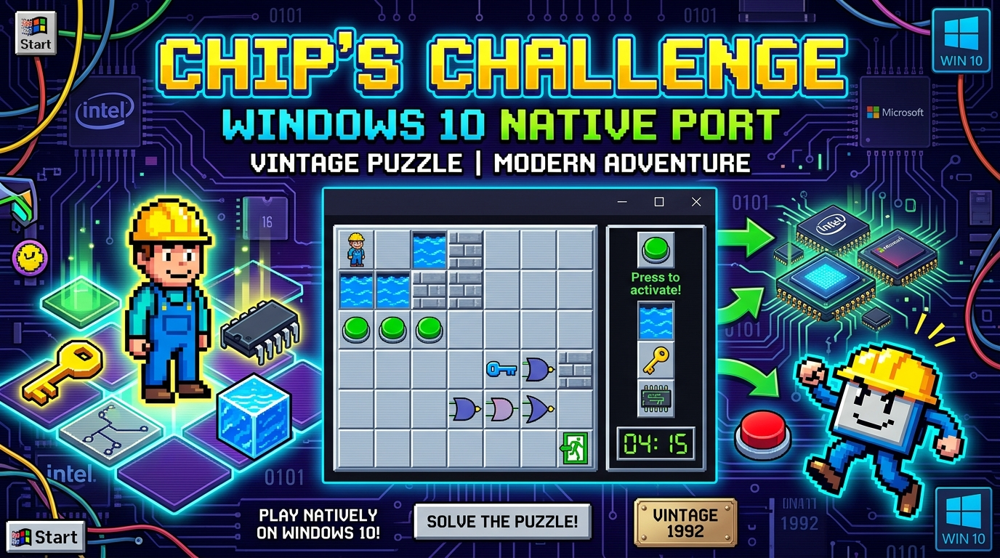

# Chip's Challenge - Windows 10 (64-bit) Native Port & Preservation Project



> **Disclaimer: For Educational & Historical Preservation Purposes Only**  
> *Chip's Challenge* is the intellectual property of its original creators and copyright holders (Microsoft / Epyx). This repository is an educational software engineering study focused on reverse engineering legacy 16-bit Windows 3.1 executables, developing modern Win32/Win64 compatibility layers, and porting vintage entertainment software to modern 64-bit operating systems.

---

## Welcome, Developers & Retro Enthusiasts!

Ever wondered how 16-bit Windows 3.1 games can be brought back to life on modern 64-bit Windows 10 and 11 without running a heavy, slow virtual machine? 

This repository provides **two complete, battle-tested solutions** for playing all **149 original levels** of *Chip's Challenge*:
1. **Direct Method (`direct_method/`)**: Runs the authentic 1991 16-bit binary (`CHIPS.EXE`) directly on Windows 10 x64 using WineVDM user-mode API thunking.
2. **Redesign Method (`redesign_method/`)**: A clean-room **native 64-bit C99 engine port** with zero external dependencies, compiled directly for modern Windows using Win32 GDI and WinMM.

---

## Repository Structure

```
win10_cc/
├── assets/                         # Extracted sprites, audio, icon, and project banner
├── direct_method/                  # METHOD 1: 16-bit Compatibility Layer
│   ├── chips_challenge/            # Original 16-bit files (CHIPS.EXE, CHIPS.DAT, WAV, MID)
│   ├── tools/otvdm/                # WineVDM portable runtime (~4 MB)
│   ├── play_original.exe           # 64-bit launcher with authentic icon
│   ├── play_original.bat           # Script launcher
│   ├── setup_requirements.bat      # Automated toolchain & asset setup
│   ├── setup_requirements.exe      # One-click helper utility
│   └── DIRECT_METHOD_GUIDE.md      # User & technical guide
│
├── redesign_method/                # METHOD 2: Native 64-bit C Engine Port
│   ├── include/ & src/             # Modular C99 engine source code
│   ├── assets/                     # Sprites BMP, Audio WAV/MID, and CHIPS.DAT
│   ├── scripts/ & tests/           # Asset extraction tools and unit tests
│   ├── chips_win10.exe             # Native 64-bit PE executable with authentic icon
│   ├── play_chips.bat              # Game launcher shortcut
│   ├── build.bat & Makefile        # Fast compilation scripts
│   ├── setup_requirements.bat      # Toolchain check & build script
│   ├── setup_requirements.exe      # One-click helper executable
│   └── REDESIGN_METHOD_GUIDE.md    # Developer & architecture guide
│
├── troubleshoot.md                 # Detailed log of bugs encountered and solved
├── plan.md                         # Architecture roadmap and technical analysis
└── README.md                       # Project overview (this document)
```

---

## 149 Levels & Community Challenge

The complete original database of **149 levels** (`CHIPS.DAT`) is fully loaded and playable.

| Milestone Level | Password | Title | Verified Mechanics |
| :---: | :---: | :--- | :--- |
| **Level 1** | `BDHP` | LESSON 1 | Controls, keys, colored doors, computer chips, exit socket |
| **Level 2** | `JXMJ` | LESSON 2 | Bug movement (left-edge follower AI), dirt block water pushing |
| **Level 3** | `ECBQ` | LESSON 3 | Fire boots, fire tiles, glider monster navigation |
| **Level 4** | `YMCJ` | LESSON 4 | Ice skates, inertia physics, curved ice slides |
| **Level 5** | `TQKB` | LESSON 5 | Suction boots, force floors (conveyor belts) |
| **Level 8** | `NHAG` | LESSON 8 | Thief mechanics (inventory boot stripping) |
| **Level 9** | `KCRE` | NUTS AND BOLTS | Bomb detonation via dirt block, balloon pop sound effect |
| **Levels 10 – 149** | *Explore!* | *Various* | Teleports, brown trap buttons, blue tank buttons, clone machines... |

### The Open Challenge for GitHub Contributors:
We have solved fundamental core mechanics, monster AI algorithms, and audio synchronizations across initial milestone levels. **We challenge the GitHub community to play through levels 10 to 149** and submit Pull Requests for edge-case behaviors:
- [ ] Clone machine spawn timing & queue parity
- [ ] Teleport exit direction search priority loops
- [ ] Speedrun glitch parity with the 1991 MSCC release
- [ ] High-DPI window scaling and custom level pack loaders

Check out our complete engineering journey in [**`troubleshoot.md`**](troubleshoot.md) to see how past bugs were investigated and fixed!

---

## Solved Engineering Challenges & Troubleshooting

During the development and testing of this project, several intricate retro-computing issues were uncovered and solved:

1. **Win16 Binary Execution on 64-bit Windows:**  
   Overcame the absence of NTVDM in Windows 10 64-bit by deploying WineVDM (`otvdm`) user-mode thunking alongside a native C99 engine port.
2. **Dirt Block Submersion & Water Bridging:**  
   Fixed an issue in Level 2 where dirt blocks pushing into water froze. Now adheres strictly to MSCC rules: block sinks into water, turns to dirt, and converts to solid floor when stepped upon.
3. **Immobile Monsters Across All Levels:**  
   Extracted creature coordinates from **Field 10** of `CHIPS.DAT` and built an authentic MS ruleset AI for all 9 creatures (Bug, Paramecium, Fireball, Glider, Pink Ball, Tank, Teeth, Walker, Blob) running on a 250ms (4 Hz) movement timer.
4. **Missing Bomb Detonation Sound (Balloon Pop) in Level 9:**  
   Discovered that the original `entpack.ini` looked for non-existent `hit3.wav`. Reconfigured and supplied the authentic balloon pop sound (`POP2.WAV`), while also restoring missing socket chimes (`CHIMES.WAV`), timeout bell (`BELL.WAV`), and timer ticks (`CLICK1.WAV`).
5. **Authentic Icon Extraction:**  
   Retrieved the 16-bit icon resource from `CHIPS.EXE`, converted it into modern `.ico` format, and embedded it via `windres` into all 64-bit binaries.
6. **Password & Level Navigation:**  
   Integrated a native Win32 dialog (`Ctrl+G` / `F3`) supporting both 4-letter passwords and numeric level jumps (`1` - `149`).

Full technical breakdown available in [**`troubleshoot.md`**](troubleshoot.md).

---

## Quick Start: How to Play

### Option 1: Direct Method (Original 1991 16-bit Version)
1. Navigate to [`direct_method/`](direct_method/).
2. Double-click **`play_original.exe`** (or run `play_original.bat`).
3. Enjoy 100% byte-for-byte authentic gameplay with original retro window styling!

### Option 2: Redesign Method (Native 64-bit C Engine)
1. Navigate to [`redesign_method/`](redesign_method/).
2. Double-click **`chips_win10.exe`** (or run `play_chips.bat`).
3. Controls:
   - **Move:** Arrow Keys or `W`, `A`, `S`, `D`
   - **Password / Jump to Level:** `Ctrl+G` or `F3`
   - **Restart Level:** `F2` or `R`
   - **Toggle Sound:** `M`
   - **Hint:** `H`

---

## How to Build from Source

Prerequisites:
- **C Compiler:** MinGW-w64 GCC (e.g. `gcc.exe`)
- **Scripting:** Python 3 (only needed for asset extraction)

To recompile the native engine and launchers:
```cmd
# Recompile native C engine
cd redesign_method
build.bat

# Or run the automated setup
setup_requirements.bat
```

---

## Contributing

Contributions, issue reports, and speedrun timing validations are very welcome!
1. Fork this repository.
2. Create your feature branch (`git checkout -b feature/level-edge-case`).
3. Commit your enhancements (`git commit -m "Fix teleport priority loop in level 34"`).
4. Push to your branch and open a Pull Request.

Happy puzzling, and have fun mastering Chip's Challenge on Windows 10!
